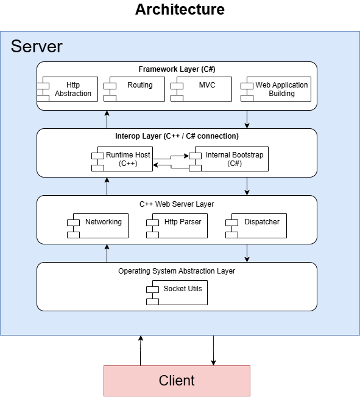

# dotNetClone
# Hybrid Web Application Framework (ASP.NET Core Clone)

A high-performance, experimental web application framework inspired by Microsoft's ASP.NET Core and Laravel's elegant architecture. This project features a custom **C++ Web Server Engine** handling low-level networking, which embeds and interacts with a **C# Framework Core** using native .NET runtime hosting.

Built as an advanced systems-engineering project to bridge the gap between low-level unmanaged systems programming and high-level managed application development.

---

## 🏗️ Architecture Overview

The framework is built using a **Layered Architecture with MVC** to achieve high abstraction, strict separation of concerns, and an efficient request/response lifecycle.



* **Layer 1 (OS Abstraction):** Bridges the gap between the host operating system and the server, abstracting low-level system calls and platform-specific socket architectures.
* **Layer 2 (Web Server Engine):** Manages full socket lifecycles, provides HTTP parsing, and handles HTTPS SSL/TLS encryption/decryption using OpenSSL. Features a **zero-copy approach** to minimize memory copying overhead maximize throughput.
* **Layer 3 (Interop Layer):** Embeds and hosts the native `.NET Runtime` directly inside the C++ process. It establishes a high-speed execution bridge between unmanaged C++ memory and managed C# memory.
* **Layer 4 (Framework Core):** Written in C#, this layer provides the application-level logic—including a routing engine, custom middleware support, and the MVC pattern.

---

## 🚀 Features & Core Use Cases

### 1. Defining RESTful API Endpoints
You can easily map standard HTTP verbs (GET, POST, PUT, DELETE) to specific logic closures or controller actions using a clean, modern routing system.

```csharp
// Program.cs or RouteConfig.cs
app.MapGet("/api/products", async httpContext => {
    httpContext.Response.Json(new { message = "Fetching all products" });
});

Route.Post("/api/products", async httpContext => {
    var payload = httpContext.Request.GetBody();
    httpContext.Response.Ok();
});
```
### 2. Creating Custom Middleware
```csharp
public class AuthMiddleware : IMiddleware
{
    public async Task InvokeAsync(HttpContext context, NextDelegate next)
    {
        if (!context.Request.Headers.ContainsKey("Authorization"))
        {
            context.Response.StatusCode = 401;
            await context.Response.WriteAsync("Unauthorized: Missing Token");
            return; // Short-circuit the request pipeline
        }

        // Pass control to the next middleware in the pipeline
        await next(context);
    }
}
```
